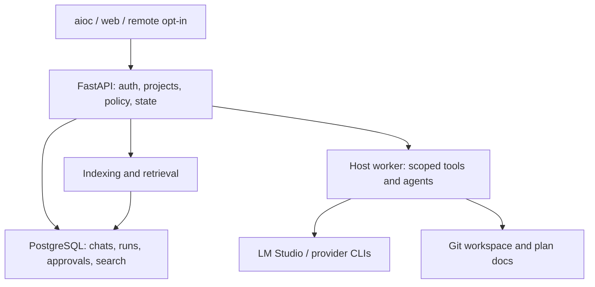

# AI Assistant: architecture and implementation plan

**Planning snapshot:** 2026-09-26; `ai-orchestrator` main at `6c3df623f6117cb54272bfb5bc8cac3672db5f02`. **Implementation branch:** `agent/ai-assistant-architecture-roadmap`. This is a plan, not evidence that live services or hardware were tested. Supersede findings when the checkout changes.

## Outcome and design decisions

Build the broader **AI Assistant** product inside `ai-orchestrator`: a local-first workspace with durable projects and chats, project-aware retrieval and memory, safe tools, and resumable runs using local models and coding agents. Git and project documents describe intended work; PostgreSQL records identity, state, approvals, execution and search data; provider sessions are disposable acceleration hints. The Python service owns durable state and authorization, the host worker owns local execution, and the TypeScript/Bun chat and web clients consume the same contracts. Keep `ai-assistant` as a prototype/reference; keep `scripts` as the source of reusable agent-workflow conventions.

**Architecture decisions to settle with short ADRs in stage S1:**

1. **One product, one authority.** Extend the existing `projects` domain into workspaces/repos; do not create a second independent workspace database. PostgreSQL is the source of truth for chats, notes, run checkpoints and approvals. Git-tracked plans, instructions and handoffs remain authoritative for the intended change.
2. **Thin clients, explicit boundaries.** FastAPI provides authenticated project, chat, retrieval, tool-approval and run APIs. `aioc`, the Bun WebSocket server and koweb use a versioned API/event contract. Move cross-client project globals and state-changing tool policy out of the Bun process. Keep Bun inference loops initially, using a server-owned persistence/policy API; move inference only if measured integration needs it. Transitional adapters preserve `aioc` and `/ws/chat` behavior.
3. **Local-first security.** Bind services to loopback initially. A project root and explicit capabilities constrain tools. Require server-issued approval records for risky actions; provider tool requests never themselves confer authorization. Remote access is opt-in through an authenticated boundary.
4. **Incremental evidence.** Prove the current live model, worker and indexers first. Preserve the filesystem queue while hardening its contract; only migrate execution to a durable Postgres scheduler after a restart/cooldown experiment shows the benefit and migration design.
5. **No second memory or vector product.** Evolve the existing pgvector, code/text ingestion and retrieval, with evaluation and provenance. Explicit memory notes and review state sit above retrieval.

### Source snapshot and limits

| Area | Evidence in checkout | Assessment |
| --- | --- | --- |
| Chat | [`QueryEngine.ts`](https://github.com/MaxCarlson/ai-orchestrator/blob/6c3df623f6117cb54272bfb5bc8cac3672db5f02/chat/src/QueryEngine.ts), [session store](https://github.com/MaxCarlson/ai-orchestrator/blob/6c3df623f6117cb54272bfb5bc8cac3672db5f02/chat/src/session/store.ts), [Bun server](https://github.com/MaxCarlson/ai-orchestrator/blob/6c3df623f6117cb54272bfb5bc8cac3672db5f02/chat/src/server.ts) | Partly implemented. Messages live in memory; `submit()` persists only the user message after a turn, so assistant/tool history and interrupted turns cannot reliably survive restart. |
| Projects | [context](https://github.com/MaxCarlson/ai-orchestrator/blob/6c3df623f6117cb54272bfb5bc8cac3672db5f02/chat/src/project/context.ts), [detector](https://github.com/MaxCarlson/ai-orchestrator/blob/6c3df623f6117cb54272bfb5bc8cac3672db5f02/chat/src/project/detector.ts), API `projects` | Partly implemented. A module-global chat context can bleed across connections, while mutable workdir and DB project IDs are not one validated workspace identity. |
| Tools and exposure | [BashTool](https://github.com/MaxCarlson/ai-orchestrator/blob/6c3df623f6117cb54272bfb5bc8cac3672db5f02/chat/src/tools/BashTool.ts), [FileEditTool](https://github.com/MaxCarlson/ai-orchestrator/blob/6c3df623f6117cb54272bfb5bc8cac3672db5f02/chat/src/tools/FileEditTool.ts), [web viewer](https://github.com/MaxCarlson/ai-orchestrator/blob/6c3df623f6117cb54272bfb5bc8cac3672db5f02/orchestrator_web_viewer/main.py), [Compose](https://github.com/MaxCarlson/ai-orchestrator/blob/6c3df623f6117cb54272bfb5bc8cac3672db5f02/docker-compose.yml) | Tools exist but lack a shared permission and path boundary. Bash runs `bash -c`; web fetch accepts a URL; default web auth is disabled, chat WebSocket needs authentication, ports are published, and koweb mounts the Docker socket. Address before remote or unattended use. |
| Tasks | [filesystem queue](https://github.com/MaxCarlson/ai-orchestrator/blob/6c3df623f6117cb54272bfb5bc8cac3672db5f02/shared/task_queue.py), [host loop](https://github.com/MaxCarlson/ai-orchestrator/blob/6c3df623f6117cb54272bfb5bc8cac3672db5f02/bin/local_worker_loop.sh) | Partly implemented, runtime unverified. Status-file moves are not a cross-process transactional claim; raw shell commands and user-supplied `approved_by` are not an authorization design. |
| Index/search | [code indexer](https://github.com/MaxCarlson/ai-orchestrator/blob/6c3df623f6117cb54272bfb5bc8cac3672db5f02/memory/code_indexer.py), [text pipeline](https://github.com/MaxCarlson/ai-orchestrator/blob/6c3df623f6117cb54272bfb5bc8cac3672db5f02/memory/ingest_pipeline.py), [hybrid retrieval](https://github.com/MaxCarlson/ai-orchestrator/blob/6c3df623f6117cb54272bfb5bc8cac3672db5f02/memory/retrieval.py) | Substantial implementation, quality unmeasured. Code scans every file recursively, lacks deletion reconciliation, and Python AST coverage is narrow; text ingestion **already reconciles** changed/deleted files. Hybrid BM25/RRF/reranking exists but has in-process scope caches and no measured benchmark. |
| Memory | [manager](https://github.com/MaxCarlson/ai-orchestrator/blob/6c3df623f6117cb54272bfb5bc8cac3672db5f02/memory/manager.py), [plan](https://github.com/MaxCarlson/ai-orchestrator/blob/6c3df623f6117cb54272bfb5bc8cac3672db5f02/memory/PLAN.md) | Storage/search exists. Kind taxonomy, reviewed creation/edit/merge/prune and bounded chat injection remain to implement or verify. |
| Docs/schema | [priorities](https://github.com/MaxCarlson/ai-orchestrator/blob/6c3df623f6117cb54272bfb5bc8cac3672db5f02/docs/NEXT_STEPS.md), [schema](https://github.com/MaxCarlson/ai-orchestrator/blob/6c3df623f6117cb54272bfb5bc8cac3672db5f02/docker/postgres/init-scripts/01_init_schema.sql), [API](https://github.com/MaxCarlson/ai-orchestrator/blob/6c3df623f6117cb54272bfb5bc8cac3672db5f02/docker/orchestrator/main.py) | `CURRENT_STATE.md` is dated January 2026; `NEXT_STEPS.md` describes a GET memory endpoint while current API exposes POST searches. Schema setup is split between init scripts and startup DDL in a large `main.py`. Establish migrations and correct docs against tested behavior. |

Repository tree contains about 5,710 tracked paths, mostly `node_modules` (about 5,431). This is a concrete index-size and repository-hygiene issue; first inventory ignored/untracked vs tracked inputs with `git ls-files` on a real checkout, then remove tracked dependencies in a separate reviewed cleanup, preserve lockfiles, and record index-size before/after. This inspection used GitHub sources; **no** running LM Studio server, loaded model, DB row counts, host loop, WebSocket stream or end-to-end recovery was verified here.

### Roles of adjacent repositories

| Repository | Reuse | Do not merge |
| --- | --- | --- |
| [`ai-assistant` main](https://github.com/MaxCarlson/ai-assistant/tree/main) and [`gemimi-agent-v2`](https://github.com/MaxCarlson/ai-assistant/tree/gemimi-agent-v2) | Product concepts, Termux/TUI workflows and tests as reference. Port a bounded idea only after a contract and behavior test. | Its separate Python agent/task manager, FAISS/Weaviate experiments, `tasks.json`, or workspace implementation. On `gemimi-agent-v2`, `task_manager.py` writes `working_dir`, `workspace_manager.py` reads `workspace_path` with `SANDBOX_ENABLED = False`; unsafe to transplant. |
| [`scripts/AGENTS.md`](https://github.com/MaxCarlson/scripts/blob/main/AGENTS.md), [`REPO_LLM_INSTRUCTIONS.md`](https://github.com/MaxCarlson/scripts/blob/main/REPO_LLM_INSTRUCTIONS.md) | Adopt repo-readable staged plans, status, handoffs and validation evidence for this repo; honor existing project instruction files. | A duplicate orchestrator-owned intent store that competes with Git docs. |
| [`agent_sync`](https://github.com/MaxCarlson/scripts/tree/main/modules/agent_sync), [`agent_memory`](https://github.com/MaxCarlson/scripts/tree/main/modules/agent_memory), [`development_ledger`](https://github.com/MaxCarlson/scripts/tree/main/modules/development_ledger) and `llm_local` | Borrow bounded delegation/prompt-pack contracts, Markdown memory note format, traceable plan IDs/validation events and LM Studio client behaviors. Explore optional import/export of note and handoff formats. | A second SQLite task scheduler, unverified hooks, copy-pasted provider orchestration, or mandatory coupling to scripts installation. `agent_sync` explicitly documents itself as a separate lightweight CLI. |

## Target contracts and topology

Define stable IDs `workspace_id`, `project_id`, `conversation_id`, `run_id`, `step_id`, `attempt_id`, `tool_call_id`, `approval_id`; explicitly map existing IDs. Project = logical knowledge/instructions scope; workspace = canonical local root (optionally multiple repos/checkout bindings) with owner, allowed roots and platform path; repo Git identity is metadata, not permission. A conversation belongs to exactly one project and workspace binding at creation; switching is an explicit new binding/turn. Version REST/OpenAPI plus a tagged streaming event schema (`seq`, `event_id`, `conversation_id`, `turn_id`, `type`, payload). Reconnect uses `after_seq` and reconciles committed events; transient token deltas need not be permanently stored, but canonical finalized messages/tool events must be.

Use a canonical ordered turn log: user accepted -> provider request -> assistant/tool-call proposed -> approval decision -> tool result -> assistant finalized/error. In one DB transaction persist canonical message/event and next sequence; allocate request idempotency keys so retries do not duplicate turns or actions. A context builder reads authorized layers in deterministic order: product policy, global user instructions, project instructions, Git instruction files, recent conversation/summary, cited retrieval, reviewed memory, current request. Record source, version/hash, truncation and token count; content from files/search is data and never grants tool permission. Use per-model token counting or a conservative budget with reserve for response/tool turns. Schema migration through Alembic (assess existing Alembic dependency), with backward compatible rollout, backup and verified restore; no new ad hoc startup DDL.

## Stages in dependency order

Each stage has an owner repository (`ai-orchestrator` unless stated), target code area, migration path and acceptance gate. 'Implemented' below means the code exists, **not** that live operation passed. Order gives fast feedback and avoids building unattended execution on untrusted tools. Small security fixes in S1 precede any new network access; S3 closes the full tool boundary before S7.

### S0 — Baseline, smoke tests and inventory (first)

**Goal/status:** Prove what the implemented core actually does; live behavior unverified. Work in `chat/`, `docker/`, `bin/`, `memory/` and `docs/`. Pin versions, dependency installation, DB migration snapshot and seed test project. From the host, verify `lms server status`/loaded models and direct `/v1/models`, then a real `aioc` prompt, two-turn history and web `/ws/chat` stream; inspect `ensureLmStudio()` and model tool-call compatibility. A working `lms` binary alone is insufficient. Start `bin/local_worker_loop.sh`, queue a harmless task, capture task JSON/logs/status, restart loop and check behavior. Queue code/text indexing on a *small known* repo and verify owner-scoped rows, deletion/reindex and both search endpoints. Run existing Bun typecheck/tests and targeted Python tests listed in `docs/NEXT_STEPS.md`; record exact commands/results and timestamps. Compare readme, `CURRENT_STATE.md` and `NEXT_STEPS.md` to actual API route table. No model availability claim until host evidence.

**Gate:** A recorded repeatable setup and smoke report: each of chat over both clients, worker task execution, two-turn replay after service restart, and relevant indexed results is marked pass, fail with reproduction, or blocked by environment. History replay is expected to fail today and becomes an S2 acceptance gate. If network/live host is unavailable, do not mark checks passed. Do not defer S1 exposure fixes while experimenting.

### S1 — Service boundary, identity, schema and immediate containment

**Goal/status:** Partly implemented with unsafe defaults. In `docker-compose.yml`, `orchestrator_web_viewer/main.py`, `api/chat.py`, `chat/src/server.ts`, `docker/orchestrator/main.py`, `shared/`: bind UI/API/DB/chat ports to `127.0.0.1` by default; remove Docker socket from web runtime or isolate behind a minimal privileged host helper; constrain CORS origins. Use an authenticated session/token with documented local bootstrap, enforce it on HTTP, both WebSocket handshake paths, and direct Bun connections; check Origin and project access. The server, not request body, binds actor identity to approvals. Retain loopback-only optional development mode, never treat CORS or loopback as sufficient for remote exposure. Mask secrets and prompt/tool log contents by default, set retention and debug opt-in.

**Architecture:** Modularize the 2,700-line orchestrator `main.py` into routers, domain services and repository adapters incrementally. Add Alembic migrations for schema versions, ownership/bindings, conversations and audit. Keep init scripts for fresh DB bootstrap only after migration compatibility proof. Generate TS API types from OpenAPI or shared JSON Schema and add contract tests for stream events; avoid two independently maintained payload definitions. Transition existing `projects` metadata and viewer API instead of creating competing entities. Inspect `celery`/`redis` dependencies for actual use; prune only in a versioned dependency cleanup.

**Gate:** Anonymous HTTP/WS and direct-port calls cannot access a project or execute tools; authenticated current clients still work; fresh DB and upgraded populated DB migrate with backup/restore demonstration. A cross-client project-isolation test passes.

### S2 — Durable workspaces, instructions, chats and context

**Goal/status:** Project detection and session JSON exist; architecture needs replacement. In `chat/src/QueryEngine.ts`, `chat/src/session/`, `chat/src/project/`, API projects and DB: move persistence to server-owned conversation/turn/message tables (role, content blocks, tool_call_id, status, parent/sequence, timestamps, provider metadata), with unique idempotency keys and append transaction. Save the user turn before inference and assistant/tool results as they complete; mark interrupted turns explicitly. On reconnect/CLI reopen load canonical history; `/clear` starts a new conversation or records a visible clear action, never silently deletes history. Backfill old `~/.ai-orchestrator/sessions` user-only JSON as labeled incomplete imports, retaining originals/backup and reporting counts; do not manufacture missing assistant responses.

**Context and identity:** Construct per-request immutable `ProjectContext` keyed by authenticated client, project and workspace, replacing module-global `_ctx`; resolve `/project` and `set_workdir` against registered canonical roots with repo redetection. Global instructions are user-owned and versioned; project instructions are project-owned; repo instruction files (`AGENTS.md`, `CLAUDE.md`, `GEMINI.md`, `CHAT.md`, `REPO_LLM_INSTRUCTIONS.md`) are read from the bound root with transparent precedence and only provider-relevant applicability. Never silently duplicate contradictory contents. Keep files in Git, store hash/index/selection in DB; allow project uploads under a managed project store. Record which instruction versions built each turn. Distinguish conversation summary from long-term memory; summaries are recomputable/correctable and cannot authorize actions.

**Gate:** Two clients in distinct projects cannot leak instructions/history; restart after a multi-tool, multi-turn exchange recreates full ordered history and tool linkage; imported JSON limitations are visible; instruction edits are reflected on the next turn with provenance.

### S3 — Permissioned tool broker and host execution

**Goal/status:** `BashTool`, file read/edit/glob/grep, web fetch and raw-command worker exist but do not meet controlled-tool goal. Define typed tool request/result envelopes and central policy evaluated **at execution time** against authenticated actor, project/workspace, capability, canonical path/URL, action, resource limits and approval state. Policy returns allow/deny/approval-required with reason. Read-only inside workspace is default; create/edit/delete, console, Git write, network download and process invocation have explicit grants. Review of pending action shows exact command/paths/remote, preview/diff, expiry and one-time `approval_id`; decision stores authenticated actor and is checked atomically at execution, with no `approved_by` supplied by model/client. Audit input hashes, redacted arguments, decision, result digest, exit code, bytes and run linkage.

**Implementation:** Put execution in a constrained host worker process with configured workspace root, process group timeout, stdout/stderr caps, environment allowlist and cancellation. No shell interpolation for structured index/Git commands; use argument arrays. Interactive console can remain explicit shell only with approval and containment. Resolve paths including symlinks; validate parent for creation, recheck after approval, reject absolute/escape paths and symlink races using directory-relative handles or OS confinement for stronger guarantees. Git operations expose status/diff/read, then reviewed add/commit/branch/checkout/push as distinct capabilities; never silently commit/push. Web search uses a provider interface; download validates scheme, DNS/IP, redirects, size/type and destination scope. MCP may expose approved external tools through this broker later; server names are not automatically trusted. Provider CLI agents with their **own** shell/file abilities cannot be fully intercepted by the broker; start in restrictive CLI permission modes and isolated worktrees with OS boundaries, and classify their native permissions separately. A tool approval in AI Assistant must never imply unlimited native provider autonomy.

**Gate:** Path escape, symlink, unregistered root, SSRF/private-address, approval replay/forgery, command timeout, cancellation and cross-project tests fail closed; UI/CLI can approve the exact pending action; every attempt has a bounded, redacted audit record.

### S4 — Code and document indexing, retrieval and context injection

**Goal/status:** pgvector, CodeBERT, BGE, BM25, RRF, optional reranker, PDF/text loaders and direct/source ingestion exist; quality/scale and chat integration remain unproved. In `memory/code_indexer.py`, `code_chunking.py`, `ingest_pipeline.py`, `retrieval.py`, `models.py`, API search: first index a real small repo and create a 20–50-question gold set with expected file/line snippets, mixed code/document queries, deleted file, renamed file and second-project decoy. Report Recall@k/MRR, missing-path rate, latency, tokens and index footprint; compare lexical-only, dense-only, hybrid and reranked under the same set. Keep existing models if measured quality is adequate.

**Code migration:** Replace `rglob('*')` with `git ls-files`/ignore-aware traversal plus configurable untracked document roots, file-type/size/binary limits and symlink rules. Introduce a manifest keyed by workspace, repo/ref, path, content hash, parser version and embedding model/version; reconcile removed/renamed chunks and invalidate when model/parser changes. Python AST top-level chunks are a seed; evaluate Tree-sitter for TS/JS and later languages using parser-specific extractors with plain-text fallback, offsets and stable symbols. No Tree-sitter dependency until tests demonstrate improvement. Text pipeline already deletes removed files and stale chunks; retain it, add consistent source/version/provenance/error status and validate its atomicity and permissions. Separate document ingestion sources from code and memory notes; no accidental indexing of secrets, build artifacts or `node_modules`.

**Retrieval architecture:** Query always filters owner/project in SQL before returning context. For small scopes, measure exact pgvector+Postgres full-text or current BM25; replace per-process full-corpus BM25 cache if memory/staleness or cross-worker coherence fails. For ANN at scale, pgvector warns filters can reduce recall; evaluate `hnsw.iterative_scan`, partition/partial index or exact search per scope from measured plans. Keep chunk IDs, source path, line/span, content hash, commit/ref and score in every result. Inject only selected, cited chunks through the S2 context builder with dedup, trust labeling and a token cap; soft-fail with visible retrieval status if unavailable. Queue indexing through a typed job and bounded worker, not password-bearing command strings.

**Gate:** Reindex without changes is cheap and stable; edit/delete/model-change reconcile; no cross-project hits; measured retrieval beats a stated lexical baseline or remains lexical-only where appropriate; a chat answer includes inspectable source paths and respects its context budget.

### S5 — Explicit, reviewable memory

**Goal/status:** `memory_items` and `global_memory_items` already support storage/search; chat injection, kind semantics and governance incomplete. Define `scope` (global/project), `kind` (preference, decision, fact, procedure, summary), provenance/source refs, review state (candidate/approved/rejected/superseded), creation/expiry/revision and owner. Use an Alembic migration with defaults, preserve existing records as imported/needs-review where origin is unclear, and update `dense_search()`/`hybrid_search()` kind/status filters plus actual POST API route documentation. Notes can be edited/versioned and exported as Markdown compatible with `scripts/agent_memory`; DB owns review/search state, repo Markdown owns explicitly chosen project plan/decision documents. Prompt-suggested memories become candidates with evidence and diff; merge/prune are reviewed revisions, not silent deletion. Deduplicate by scope and source, prevent a retrieved memory from broadening tool permissions.

**Gate:** Create/edit/reject/merge/supersede and rollback a memory; global note appears only where permitted, project note only within its project; chat shows which approved notes were injected and stays within token cap; disabling memory changes context without removing canonical notes.

### S6 — Durable queue, plan and run contract

**Goal/status:** Existing filesystem queue/host worker supplies initial execution; planned runs, safe claims/waits/resume absent. Introduce a run model with plan Git path+commit/hash, ordered stage/step IDs and acceptance checks, attempt and provider ID, checkpoint/artifact refs, heartbeat/lease, `next_attempt_at`, explicit `awaiting_approval`/`awaiting_input`/`cooldown`/`blocked` states, deadlines, failure classification and immutable event history. Import `scripts` plan/handoff/ledger IDs when present; do not force each repo into a private database-only plan. Git diff and tests are recorded per checkpoint. Authoritative transition is DB transaction; provider sessions may expire. Enforce one mutating run lease per workspace/branch, with separate read-only indexing jobs and idempotent external effects. On resume reconcile Git HEAD/status, staged diff, last action ID and pending approvals before any side effect. Classify rate-limit response with provider-specific retry-after; bounded backoff plus wake time; never spin or silently switch providers. Missing prerequisites/failed validation stop visibly.

**Migration decision:** First harden `shared/task_queue.py`/host worker with typed payloads, exclusive claim/lease and stale-task reconciliation; keep status directories and existing kmtui readers during compatibility period. Then spike **DBOS Python with existing PostgreSQL** for one index job and one two-step run: durable sleep, approval pause, restart during cooldown, idempotent resume and deploy of a new workflow version. DBOS offers durable sleep/queue/concurrency; it is a candidate, not a preapproved additional state authority. If spike meets criteria with a documented upgrade path, use DBOS for scheduling and keep the app's run/checkpoint/event tables as the user-visible canonical record; DBOS IDs map to run/step IDs and external actions stay idempotent. If it cannot safely host the existing host worker/approval boundary, implement a minimal Postgres SKIP LOCKED lease scheduler; do not also run DBOS and filesystem as two independent schedulers. Run old queue in read-only/compat mode until drained; migrate queued jobs once with ID mapping and counts, then retire writes.

**Gate:** Kill service and host worker before/during action and cooldown; after restart exactly one authorized action effect, no lost state or duplicated provider prompt/tool execution; wait survives without a polling process; plan/checkpoint/handoff explains resumption on a different provider. Demonstrate DBOS spike result before committing scheduler choice.

### S7 — Provider adapters and execution policy

**Goal/status:** Bun direct model backends and CLI integrations exist; provider sessions are not a uniform durable run abstraction. Define `ProviderAdapter`: availability/auth check; start/resume or fresh handoff; stream normalized events; rate-limit/error classification; session-id hint; cancellation; tool/approval capabilities; model metadata and token usage. First keep LM Studio OpenAI-compatible chat path and add provider capability discovery (loaded model, tools, context window, structured output) instead of treating model-name prefixes as identity. Choose **Codex first for the durable coding-agent spike**: official app-server has thread start/resume and turn/approval events; `codex exec` is simpler for bounded tasks. Use authenticated local transport, explicit workspace and policy mapping. Claude Code `-p --output-format stream-json`/`--resume` and Gemini CLI headless JSON/resume follow only after the same adapter contract passes; use official CLI/SDK docs and pin tested versions. Do not assume native tool approvals or sessions satisfy orchestrator policy or provide exactly-once execution. Local model through LM Studio is the default private path; hosted providers are explicit per-run choice with cost/data boundary disclosed in UI.

**Gate:** A bounded Codex task can pause, survive orchestrator restart and resume with a Git/checkpoint handoff even when the provider session is unavailable; cancellation/quotas/approval events normalize; later adapters pass the same conformance tests without changing run schema.

### S8 — Product UX, setup and cross-platform polish

**Goal/status:** `aioc` TUI, Bun server and web viewer already exist, but project/chat management, permissions and run visibility need integration. Ship project/workspace selector, conversation list/search/resume, instruction provenance, retrieved-source panel, memory review, exact approval diff, run timeline/cooldown/blocked reason and safe stop/resume in both clients through S1 contracts. Keep TUI scroll-wheel/arrow fixes from `NEXT_STEPS.md` behind core acceptance. Add clear local setup for Linux/WSL and macOS, then Windows host and Termux remote client only after host boundary and authentication work. Detect `lms`, server, models and worker separately; provide `doctor` with no secret output. Use packaged Bun/Python lockfiles and migrator, test offline startup and a documented backup/restore. Remote access only via authenticated TLS gateway or existing secure tunnel, never published unauthenticated DB/worker port.

**Gate:** New user can install, run doctor, create project, select chat/model, approve a tool, find a cited file, resume a cooled-down run, and export chats/memory/plan; restart and upgrade keep data. Record manual UI/WSL/Termux checks as pending until executed.

## Tooling selection and integration boundaries

| Choice | Adopt when / rationale | Integration or rejection criterion |
| --- | --- | --- |
| FastAPI + asyncpg, PostgreSQL/pgvector, Bun/TypeScript | Already present; avoid a rewrite. Modular API, generated types and migrations. | Measure DB health and migration reliability; remove redundant web DB writes when API covers them. |
| Alembic | Present in requirements; use versioned schema evolution instead of startup DDL. | Check initialized DB and fresh DB produce identical schema; backup/restore upgrade. |
| LM Studio/`llmster` | Existing local OpenAI-compatible inference and documented `lms server start`/`lms load`. | Probe actual loaded model and tool-call quality; fall back to plain chat if tooling inadequate. |
| pgvector + current embedding stack | Preserve CodeBERT/BGE and hybrid retrieval initially. | Keep/retrain/switch only after project-scoped benchmark. Separate models/dimensions; reindex on change. |
| Tree-sitter | Candidate for typed symbol chunks beyond Python AST. | Pilot TS/JS with offset and quality tests; plain-text fallback. |
| DBOS Python | Candidate for Postgres-backed durable queues/sleeps/recovery in S6. | Restart/cooldown/approval/idempotency/version upgrade spike must beat minimal lease scheduler. |
| Codex app-server; Claude Code CLI; Gemini CLI | Official session/stream interfaces behind adapters. | Check native tool permission semantics and tested versions. Do not import provider transcript as canonical plan. |
| `scripts` plan/ledger/note formats | Repo-readable handoffs and stable acceptance IDs reduce custom planning work. | Adapt formats and link evidence; no required scripts runtime or second scheduler. |
| MCP, hosted search provider | Optional adapter after broker; useful for external tools/search. | Same project policy, authenticated identity, egress filter and audit as built-in tools. |

## Delivery mechanics, tests and stop/go

Create `docs/plans/YYYYMMDD-HHMM_ai-assistant/` for execution with `00_implementation-plan.md` (this architecture, moved or linked), stage docs, `STATUS.md`, `HANDOFF.md` and `checklist.md` following scripts conventions. Use stable IDs `F-...`, `AC-Sx-...`, `MC-Sx-...`; track code present separately from validation passed. Each stage begins with an ADR for any unsettled choice and ends with a bounded commit, reviewed diff, migration/rollback notes, exact automated commands/results and environment-dependent manual checks. Never claim a host-dependent check passed from GitHub inspection. The present branch contains this planning artifact only; no product code is modified in this planning pass.

**Critical ordering:** S0 diagnosis and S1 immediate containment can overlap; S2 chat persistence and workspace identity precede memory/retrieval injection and durable runs; S3 controlled tools precede unattended execution; S4 retrieval precedes S5 memory injection; S6 scheduler follows S2/S3 and worker proof; S7 provider breadth follows one proven adapter; S8 UX is delivered incrementally with each contract, then polished. Avoid a large cross-repo merge or queue replacement before the gates.

**Initial implementation slice:** (1) Record a host smoke and route/schema inventory; (2) close unauthenticated endpoints/default port and secret logging exposure; (3) add migration-backed conversation/turn/event schema and a per-connection project context; (4) make the same two-turn chat survive a restart in `aioc` and the web client. This yields a reliable vertical product slice before retrieval, memory and planned runs.

**Verification ladder:** Unit tests for policy, path containment, chunking and state transitions; API/WS contract tests for auth/replay; integration tests using isolated Postgres and a temporary Git repo with two projects; model/provider simulator for deterministic tool calls/rate limits; live host smoke for LM Studio/worker; kill-and-restart recovery for chat, index and runs; retrieval gold-set evaluation; manual TUI/web/remote checks. Capture exact environment, model ID/version, commits, migration version, DB counts and test failures. Do not write tests that merely mirror the implementation.

**Research checked 2026-09-26 (upstream, official):** [LM Studio OpenAI-compatible tool use](https://lmstudio.ai/docs/developer/openai-compat/tools); [Codex app-server](https://developers.openai.com/codex/app-server); [Claude Code programmatic execution](https://code.claude.com/docs/en/headless); [Gemini CLI headless](https://google-gemini.github.io/gemini-cli/docs/cli/headless.html); [DBOS workflows and durable sleep](https://docs.dbos.dev/python/tutorials/workflow-tutorial), [queues/concurrency](https://docs.dbos.dev/python/tutorials/queue-tutorial); [pgvector filtering and iterative scans](https://github.com/pgvector/pgvector#filtering). Tool APIs and compatibility must be rechecked at implementation time.
